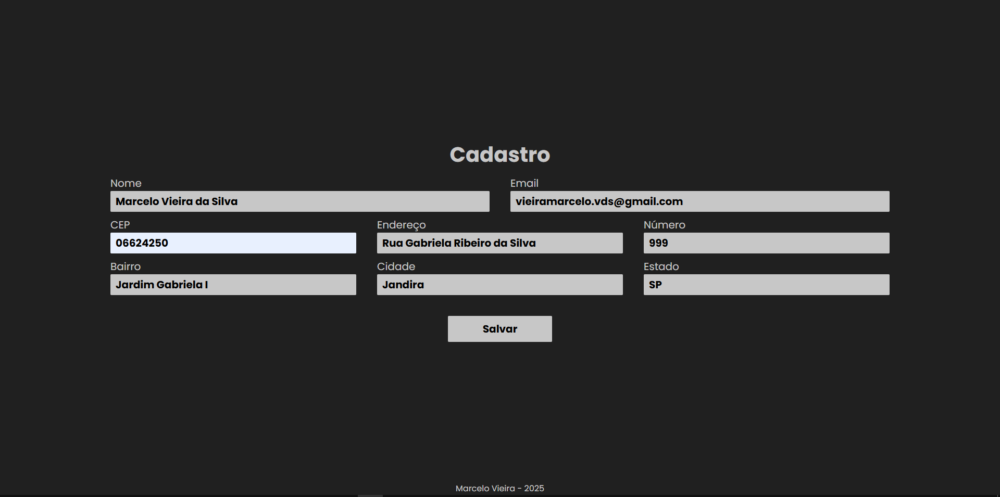

# Consumo da API-CEP com JavaScript

Página de cadastro de endereço, onde o usuario pode digitar apenas o CEP e o restante do endereço é preenchido automaticamente utilizando a API-CEP.

## Tecnologias
* HTML
* CSS
* JAVASCRIPT
* API-CEP

## Autor
[Marcelo Vieira](<https://www.linkedin.com/in/marcelovieirasilva/>)
