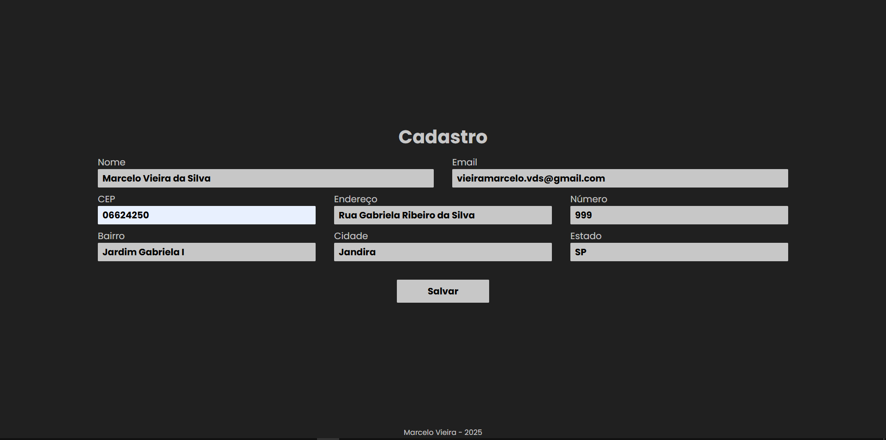

# CONSUMO DA API VIACEP COM JAVASCRIPT

Página de cadastro de endereço, onde o usuario pode digitar apenas o CEP e o restante do endereço é preenchido automaticamente utilizando a API ViaCEP, este projeto foi criado com base na [Videoaula do Professor Leonid](<https://www.youtube.com/watch?v=imk6Y0viabg>) 

## Tecnologias
* HTML
* CSS
* JAVASCRIPT
* API VIACEP

## Autor
[Marcelo Vieira](<https://www.linkedin.com/in/marcelovieirasilva/>)